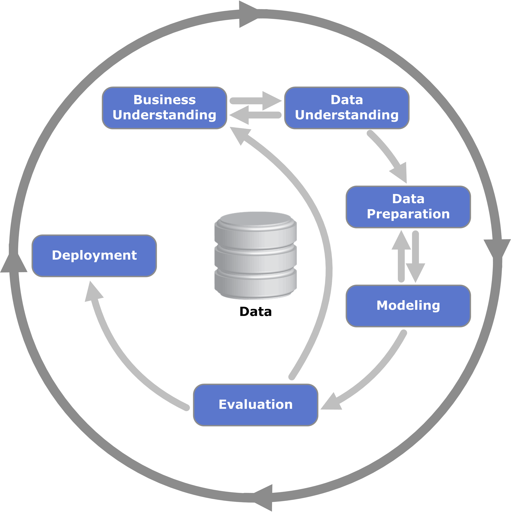

# ML Process

## Sample, Explore, Modify, Model, and Assess

Wiki: [SEMMA](https://en.wikipedia.org/wiki/SEMMA)

데이터 마이닝 애플리케이션 구현 방법론.

- SEMMA는 SAS 엔터프라이즈에서 사용하기 위해서 만들어졌다. 따라서 다른 소프트웨어는 사용하기 어렵다.  
- CRISP-DM과 달리 비즈니스 이해 단계가 없다.
- 데이터 마이닝 방법론이 아니다.

## CRISP-DM

데이터 마이닝 전문가들이 흔히 사용하는 표준 프로세스 모델이다.

Wiki: [Cross-industry standard process for data mining](https://en.wikipedia.org/wiki/Cross-industry_standard_process_for_data_mining)

- 데이터 마이닝 산업에 존재하는 문제들을 해결하는 많은 장점을 가진다.  
- 프로젝트 관리 활동과는 관련이 없다.  
- 산업, 도구, 애플리케이션에 중립적인 방법론이다.  

### Major 6 phases

데이터 마이닝 프로세스 6가지 단계

- Business Understanding: 데이터 이해
- Data Understanding
- Data Preparation
- Modeling
- Evaluation
- Deployment

순서는 중요하지 않다. 화살표는 자주 진행되는 순서이다. 

#### Business Understanding: 데이터 이해

- 잘 정의된 비즈니스의 문제로 시작한다.  
- 과정을 반복하며 문제를 재정의하고 해결책을 정의한다.  
- 데이터 분석 목표를 수립한다.
- (초기) 가설을 수립한다.

##### 예

비즈니스 관점:

- 목표: 수익 1000억 달성
- 방법: 신용도에 따라 대출 승인/거절

데이터 분석 관점:

- 문제 정의: 대출 신청자들의 신용도 예측이 가능한가?
- 목표: 
  - 예측으로 비즈니스 목표 달성이 가능한가?
  - 프로젝트 투자에 대한 BEP에 도달 가능한가?
- 분석:
  - **분류문제**
  - **신용도**에 영향을 미치는 **요인**은?

##### (초기) 가설 수립

신용도에 영향을 미치는 요인은 무엇일까?

#### Data Understanding

##### 데이터

- 문제를 푸는 데 필요한 요소
- **문제에 정확히 부합하는 데이터가 있는 경우는 거의 없다.**
- 데이터에 따라 데이터 취득 및 유지 비용이 다르다.

##### 데이터 원본 식별 및 취득

(초기) 가설에서 도출된 데이터의 원본을 확인

- 가용한 데이터 = 있는 데이터 + 없는 데이터
  - 있는 데이터: 그대로 사용 가능 + 가공 후 사용가능
    - 데이터 파이프라인, 데이터 환경 검토 및 과제 수행
  - 없는 데이터: 취득 가능 + 취득 불가능
    - 취득 가능한 데이터: 취득 비용 산정 과제 수행
    - 취득 불가능한 데이터: 정보의 의미 정의 -> 정보 분할 -> 최대한 가용한 데이터 영역으로 만들기

- 데이터 탐색: 
  - EDA(Exploratory Data Analysis): 탐색적 데이터 분석
    - 개별 데이터의 분포, 가설이 맞는지 파악
    - NA, 이상치 파악
  - CDA(Confirmatory Data Analysis): 확증적 데이터 분석
    - 탐색으로 파악하기 애매한 정보는 통계적 분석 도구(가설 검정) 사용

#### Data Preparation

- 데이터 분석을 위한 데이터 유형과 구조 필요
- **데이터 정제**
  - 잘못된 데이터 정제
  - NA 식별 및 조치
  - 이상치 식별 및 조치
- **추가 변수(Feature Engineering)**
  - 비즈니스 경험 + 데이터 분석 -> 인사이트 발견
- 결과물: **하나의 잘 정리된 Data Frame**(Table, Matrix)

#### Modeling

- **중요 변수** 선택 -> 적절한 **알고리즘** = 예측 **모델 생성**
- **모델 평가**
- **데이터셋 분리**
  - 학습할때: Train Set(모델 생성), Test Set(모델 성능 검증)
  - 실전에서: Validation Set(모델 성능 검증), Test Set(모델 최종 평가)

데이터셋 분리 -> 변수, 알고리즘 선택 -> 모델 학습 -> 검증 -> (변수, 알고리즘 선택)

#### Evaluation

- 모델에 대한 데이터 분석 목표 평가: 일정한 규칙이 있는지, 특정 데이터에서만 보이는 성질인지
  - 모델 최종 평가: Test Set 이용
- 비즈니스 목표 달성 평가: **어떤 비즈니스 문제를 해결했는가?**
  - 비즈니스 기대가치 평가

#### Deployment

- 프로젝트 결과물 최종 확정
  - 고객 목표 충족 확인: 프로덕션 환경의 파이프라인, 모델 및 배포
- 운영 시스템 배포
  - 품질, 성능 기준
  - 모니터링 계획 수립
