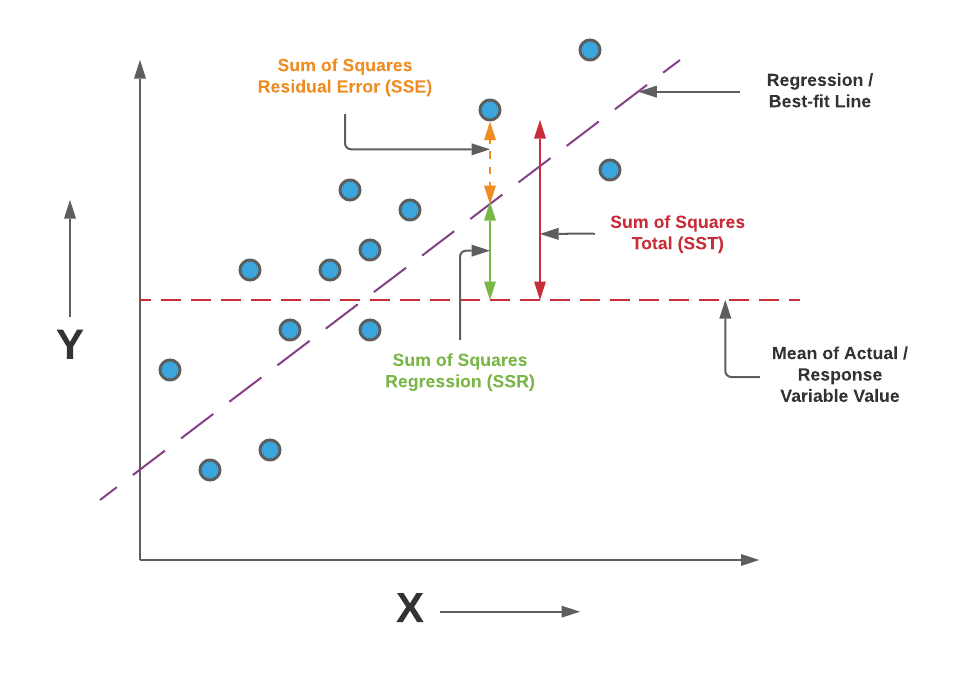

# Regression

## 모델링

- 전수 조사: 전체 모집단을 조사
- 표본 조사: 표본을 추출(sampling)하여 조사
  - 무작위 추출 방식
  - 여러 번 추출 하다보면 **표본오차** 발생
- 모델: 
  - 어떤 목적을 달성하기 위해 실세계를 단순하게 표현한 것
  - 데이터 과학에서: 관심있는 타겟값을 예측하는 공식. 수학 공식, 논리적인 문장
- 모델링: 데이터로부터 모델을 만드는 절차. 최적화된 모델을 만드는 과정
  - 최적화: 오차를 **적당하게** 최소화

## 오차

- 실제값 = 모형 + 오차
- 자료가 벗어난 정도 sum of square error
- 모델링 목표: 어떻게 오차를 최소화할 것인가?
- 오차 최소화 = 모형이 실제를 설명하는 영역 최대화
- 검정 통계량 = 효과(모델이 설명하는 변동)/오차(모델이 설명하지 못하는 변동)

### 평균

- 통계학에서 사용하는 가장 단순한 모형
- 관측값과 모형의 차이 = 이탈도(deviance)

---

## Linear Regression

- 데이터를 하나의 직선으로 요약
- 자료를 설명하는 여러 직선이 존재 가능
- 최소제곱법 Least Square: 가장 잘 설명하는 직선 한 개
- 실제값 =  + 오차

## 모델 평가

- sum squared error
- mean sse
- root mse
- mean absolute error
- mean absolute percentage error

### R Squared: 결정계수

- SST: Total sum of squares. Total Variation
- SSR: Regression sum of squares. Explained Variation by the regression
- SSE: Error sum of squares. Unexplained Variation



--

## 다중회귀 모델

```py
x.columns.tolist()
multi_regression.coef_
multi_regression.intercept_
```

- NA 처리
- Dummy Variable: One-hot Encoding
  - 범주형 -> 가변수화
- k-Nearest Neighbor
  - 장점: 데이터 분포 형태 상관 없음. 설명 변수 개수 많아도 무리 없음
  - 단점: 계산 시간 증가. 훈련 데이터를 모델에 함께 저장. 해석 어려움

---

## Code 1

```py
import numpy as np
import pandas as pd
import matplotlib.pyplot as plt

# data_path = 'https://raw.githubusercontent.com/DA4BAM/dataset/master/boston.csv'
data_path = 'data/boston.csv'
data = pd.read_csv(data_path)

from sklearn.model_selection import train_test_split

X = data.drop('medv', axis=1)
y = data.loc[:, 'medv']

train_x, test_x, train_y, test_y = train_test_split(X, y, test_size=0.3, random_state=1)

from sklearn.linear_model import LinearRegression
from sklearn.metrics import mean_squared_error

model = LinearRegression()

model.fit(train_x, train_y)

test_pred = model.predict(test_x)

mean_squared_error(test_y, test_pred, squared=False)
```

---

## Code 2

[Speed and Stopping Distances of Cars](https://github.com/DA4BAM/dataset/blob/master/cars.md)

```py
import numpy as np
import pandas as pd
import matplotlib.pyplot as plt
import matplotlib.image as mpimg

# data_path = 'https://raw.githubusercontent.com/DA4BAM/dataset/master/cars.csv'
data_path = 'data/cars.csv'
data = pd.read_csv(data_path)

data.plot.scatter(x='speed', y='dist')
plt.show()

from sklearn.model_selection import train_test_split

X = data.drop('dist', axis=1)
y = data.iloc[:, 1]

train_x, test_x, train_y, test_y = train_test_split(X, y, test_size=0.3, random_state=1)

from sklearn.linear_model import LinearRegression
from sklearn.metrics import mean_squared_error, r2_score

simple_regression = LinearRegression()

simple_regression(train_x, train_y)

test_pred = simple_regression.predict(test_x)

mean_squared_error(test_y, test_pred)
mean_squared_error(test_y, test_pred, squared=False)
r2_score(test_y, test_pred)
```

---

## Code 3

[New York Air Quality Measurements](https://stat.ethz.ch/R-manual/R-devel/library/datasets/html/airquality.html)

```py
# 라이브러리 불러오기
import numpy as np
import pandas as pd
import matplotlib.pyplot as plt
import matplotlib.image as mpimg

# 데이터 불러오기
# data_path = 'https://raw.githubusercontent.com/DA4BAM/dataset/master/airquality_simple.csv'
data_path = 'data/airquality_simple.csv'
data = pd.read_csv(data_path)

# 데이터 조사
# data.head()
# data.tail()
# data.dtypes
# data.shape
# data.describe()
# data['Month'].value_counts()
# data.isnull.sum()

# 데이터 탐색
# data.plot.scatter(x='Temp', y='Ozone')
# plt.show()
# data.plot.scatter(x='Wind', y='Ozone')
# plt.show()
# data.plot.scatter(x='Solar.R', y='Ozone')
# plt.show()

data['Date'] = pd.to_datetime(1973*10000 + data.Month*100 + data.Day, format='%Y%m%d')

# data.plot(x='Date', y='Ozone')
# plt.show()

# 생략: NA 처리 -> KNN Imputation 사용하여 넣기
# data.isnull().sum()
# data = data.fillna(method = 'ffill')
# data.isnull().sum()

# Feature Engineering
data['WeekDay'] = data.Date.dt.dayofweek
data['WorkingDay'] = 1
data.loc[data['WeekDay'].isin([0,6]), 'WorkingDay'] = 0

# Yesterday
data['Ozone_lag1'] = data['Ozone'].shift()
data['Temp_lag1'] = data['Temp'].shift()
data['Wind_lag1'] = data['Wind'].shift()
data['Solar.R_lag1'] = data['Solar.R'].shift()

data['Ozone_diff'] = data['Ozone_lag1'].shift() - data['Ozone'].shift(2)

# 7일 이동평균 오존농도
data['Ozone_MA_7_lag1'] = data['Ozone'].rolling(7, min_periods=1).mean().shift()
# 3일 이동평균 온도
data['Temp_MA_3_lag1'] = data['Temp'].rolling(3, min_periods=1).mean().shift()

# Dummy Variable
data_wd = pd.get_dummies(data['WeekDay'], prefix = 'W', drop_first = 1)
data2 = pd.concat([data, data_wd], axis=1)
drop_x = ['Solar.R','Wind','Temp','Month','Day','Date','WeekDay']
data2.drop(drop_x, axis = 1, inplace = True)

# 데이터 분리
from sklearn.model_selection  import train_test_split
X = data2.drop('Ozone', axis = 1)
y = data2.iloc[ : , 0  ]  
train_x, test_x, train_y, test_y =  train_test_split(X ,y , test_size = 0.3)

# NA 처리: KNN Imputation
from sklearn.impute import KNNImputer
imputer = KNNImputer()
# train_x.isnull().sum()
imputer.fit(train_x)
train_x = imputer.transform(train_x)
test_x = imputer.transform(test_x)

# 생략 to Numpy array: sklearn을 통해 변환되어 이미 numpy array
# train_x, train_y = train_x.values, train_y.values
# test_x, test_y = test_x.values, test_y.values

# Scaling features
from sklearn.preprocessing import MinMaxScaler
scaler = MinMaxScaler()
scaler.fit(train_x)
# train_x.min(axis=0).round(2)
# train_x.max(axis=0)
train_x = scaler.transform(train_x)
test_x = scaler.transform(test_x)
# train_x.min(axis=0)
# train_x.max(axis=0)

# 모델링
from sklearn.linear_model import LinearRegression
from sklearn.neighbors import KNeighborsRegressor
from sklearn.metrics import mean_squared_error, mean_absolute_error

# 모델링 학습
# model = LinearRegression()
model = KNeighborsRegressor()

model.fit(train_x, train_y)

# 예측
test_pred = model.predict(test_x)

# 평가
mean_squared_error(test_y, test_pred)
mean_squared_error(test_y, test_pred, squared=False)
mean_absolute_error(test_y, test_pred)
```
