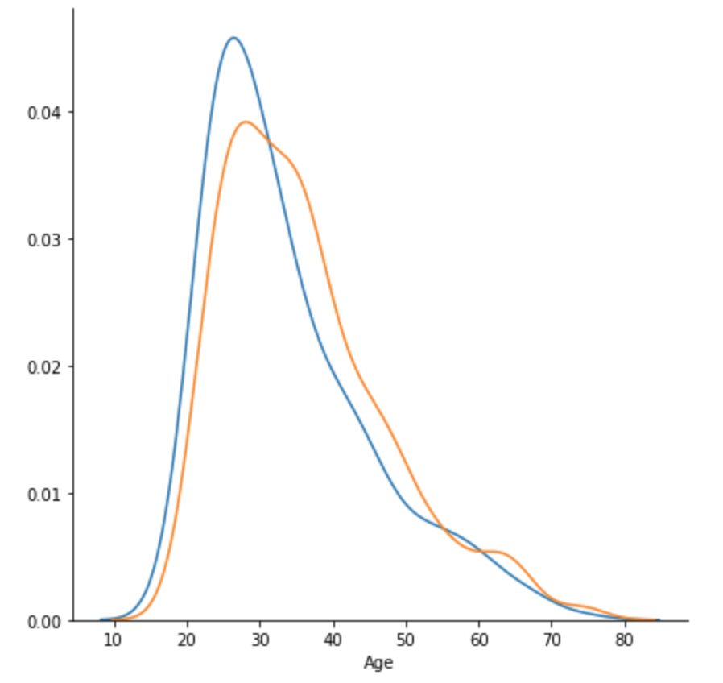
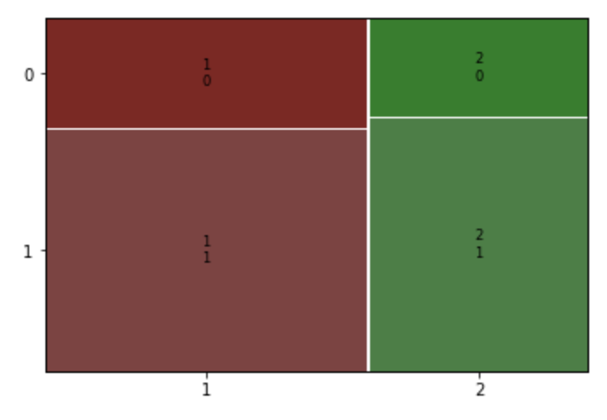

# 신용도 예측

## 환경 준비

```py
import numpy as np
import pandas as pd
import matplotlib.pyplot as plt
import seaborn as sns
from statsmodels.graphics.mosaicplot import mosaic
```

```py
credit = pd.read_csv('https://raw.githubusercontent.com/DA4BAM/dataset/master/credit_all.csv')
credit.head()
```

## 데이터 이해

```py
credit.describe()
```

신용도 좋은 사람과 좋지 않은 사람:

```py
credit.Creditability.value_counts()

1    700
0    300
Name: Creditability, dtype: int64
```

대출 신청 금액(숫자형)과 신용도(범주형) 관계:

```py
g = sns.FacetGrid(data=credit, hue='Creditability', size = 6)
g.map(sns.distplot, 'Age', kde=True, hist=False)
```



현 거주지 거주기간(범주형)과 신용도(범주형)과의 관계:

```py
mosaic(credit, ['Apartment','Creditability'])
```


성별(범주형):

```py
mosaic(credit, ['SexMarital','Creditability'])
```


가장 가치있는 자산(범주형):

```py
mosaic(credit, ['MostValuableAsset','Creditability'])
```


전화기 소유 여부(범주형):

```py
mosaic(credit, ['Telephone','Creditability'])
```



외국인 근로자 여부(범주형):

```py
mosaic(credit, ['ForeignWorker','Creditability'])
```


대출 목적(범주형):

```py
mosaic(credit, ['Purpose','Creditability'])
```


대출 납입 상태(범주형):

```py
mosaic(credit, ['Payment','Creditability'])
```


대출기간(숫자):

```py
g = sns.FacetGrid(data=credit, hue='Creditability', size = 6)
g.map(sns.distplot, 'Duration', kde=True, hist=False)
```


은행 잔고(범주형):

```py
mosaic(credit, ['AccountBalance','Creditability'])
```


대출액(숫자):

```py
g = sns.FacetGrid(data=credit, hue='Creditability', size = 6)
g.map(sns.distplot, 'CreditAmount', kde=True, hist=False)
```


### 그룹

1. 신용도와 관련이 큰 변수
   - 은행 잔고
   - 대출 기간
   - 대출 납입 상태
   - 대출 목적
   - 외국인 근로자
   - 가장 가치 있는 자산
1. 관련이 아예 없는 변수
   - 핸드폰 유무
1. 애매한 변수
   - 성별
   - 거주기간

## 전처리

### Dummy Variable

```py
dummy_vars = ['AccountBalance', 'Payment', 'Purpose', 'Employment', 'SexMarital', 'CurrentAddress', 'MostValuableAsset', 'Apartment', 'CreditCount', 'Occupation', 'Dependents', 'Telephone', 'ForeignWorker']
for each in dummy_vars:
    dummies = pd.get_dummies(credit[each], prefix=each, drop_first=True)
    credit = pd.concat([credit, dummies], axis=1)

credit = credit.drop(dummy_vars, axis=1)
```

### Data Split

```py
from sklearn.model_selection import train_test_split
X = credit.drop('Creditability', axis=1)
y = credit.iloc[:, 0]
train_x, val_x, train_y, val_y = train_test_split(X, y, test_size=0.2, random_state=1)
```

### Scaling features

```py
from sklearn.preprocessing import MinMaxScaler
scaler = MinMaxScaler()
scaler.fit(train_x)
train_x = scaler.transform(train_x)
val_x = scaler.transform(val_x)
```

### to Numpy array

```py
train_y = train_y.to_numpy()
val_y = val_y.to_numpy()
```

## 모델링

```py
from sklearn.neighbors import KNeighborsClassifier
from sklearn.ensemble import RandomForestClassifier
from xgboost import XGBClassifier
from sklearn.model_selection import cross_val_score, GridSearchCV, RandomizedSearchCV
from sklearn.metrics import confusion_matrix, accuracy_score
```

```py
estimator = KNeighborsClassifier()

param = { 'n_neighbors': list(range(1, 20)), 'leaf_size': list(range(1, 41, 5)), 'metric' : ['euclidean', 'manhattan'] }
model = GridSearchCV(estimator, param, scoring='accuracy', cv=5, n_jobs=1)
model.fit(train_x, train_y)
val_pred = model.predict(val_x)

knn_cm = confusion_matrix(val_y, val_pred)

print(model.best_params_, model.best_score_, accuracy_score(val_y, val_pred))
print(knn_cm)
```

- best params: {'leaf_size': 1, 'metric': 'manhattan', 'n_neighbors': 12}
- best score: 0.73125
- accuracy score: 0.705

[[ 18  40]
 [ 19 123]]

```py
estimator = RandomForestClassifier()

param = { 'n_estimators': list(range(1, 200, 5)) }
model = GridSearchCV(estimator, param, scoring='accuracy', cv=5, n_jobs=1)
model.fit(train_x, train_y)
val_pred = model.predict(val_x)

rf_cm = confusion_matrix(val_y, val_pred)

print(model.best_params_, model.best_score_, accuracy_score(val_y, val_pred))
print(rf_cm)
```

- best params: {'n_estimators': 136}
- best score: 0.77125
- accuracy score: 0.73

[[ 21  37]
 [ 17 125]]

```py
estimator = XGBClassifier()

param = { 'max_depth' : [3, 5, 8], 'n_estimators': [300, 500, 600], 'objective': ['binary:logistic'], 'learning_rate': [0.01, 0.1, 0.2] }
model = GridSearchCV(estimator, param, scoring='accuracy', cv=5, n_jobs=1)
model.fit(train_x, train_y)
val_pred = model.predict(val_x)

xgb_cm = confusion_matrix(val_y, val_pred)

print(model.best_params_, model.best_score_, accuracy_score(val_y, val_pred))
print(xgb_cm)
```

- best params: {'learning_rate': 0.1, 'max_depth': 3, 'n_estimators': 500, 'objective': 'binary:logistic'}
- best score: 0.73875
- accuracy score: 0.735

        예측 결과 0   1
실제 값 0    [[ 27  31]
      1     [ 22 120]]

## 비즈니스 기대가치 평가

비즈니스 가치

```py
bv = np.array([[0, -1], [0, 0.35]])
print(bv)
```

Confusion matrix 비율 변화

```py
total = np.sum(knn_cm)
p_knn = knn_cm / total
print(p_knn)

[[0.09  0.2  ]
 [0.095 0.615]]
```

```py
total = np.sum(rf_cm)
p_rf = rf_cm / total
print(p_rf)

[[0.12  0.17 ]
 [0.105 0.605]]
```

```py
total = np.sum(xgb_cm)
p_xgb = xgb_cm / total
print(p_xgb)

[[0.135 0.155]
 [0.11  0.6  ]]
```

비즈니스 기대 가치

```py
print('knn', np.sum(p_knn * bv) * 1000)
print('rf', np.sum(p_rf * bv) * 1000)
print('xgb', np.sum(p_xgb * bv) * 1000)

knn 15.249999999999986
rf 41.74999999999998
xgb 54.99999999999999
```
