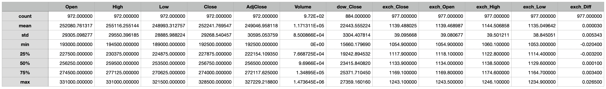
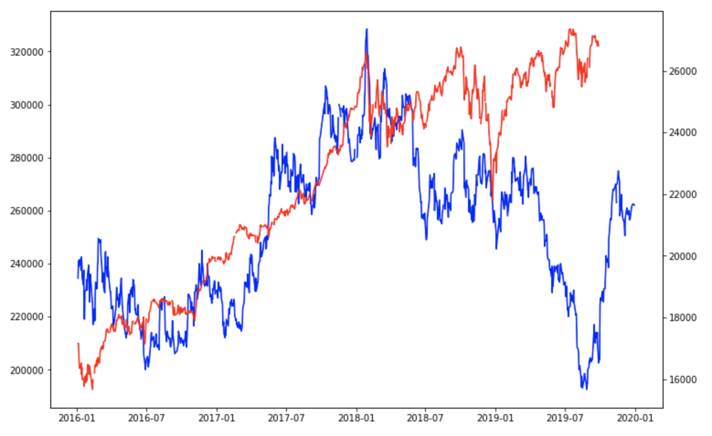
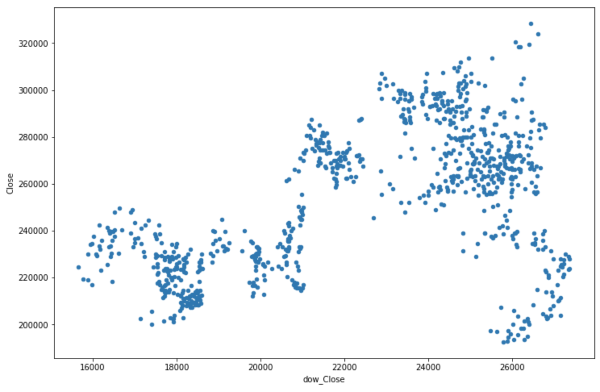
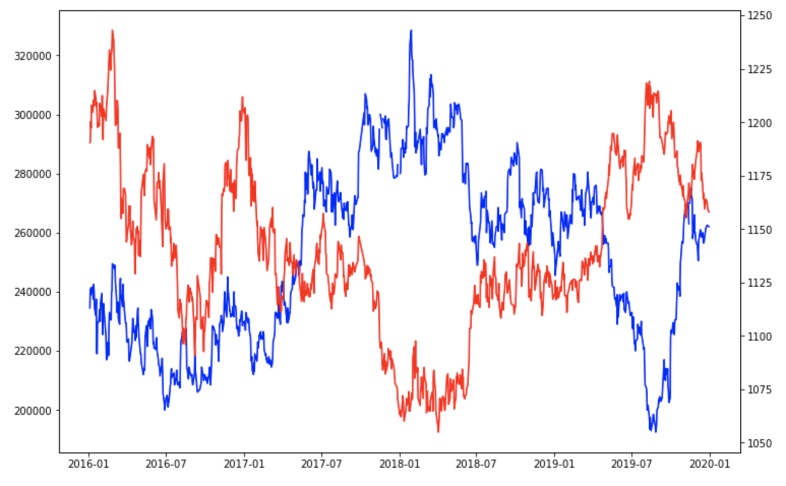
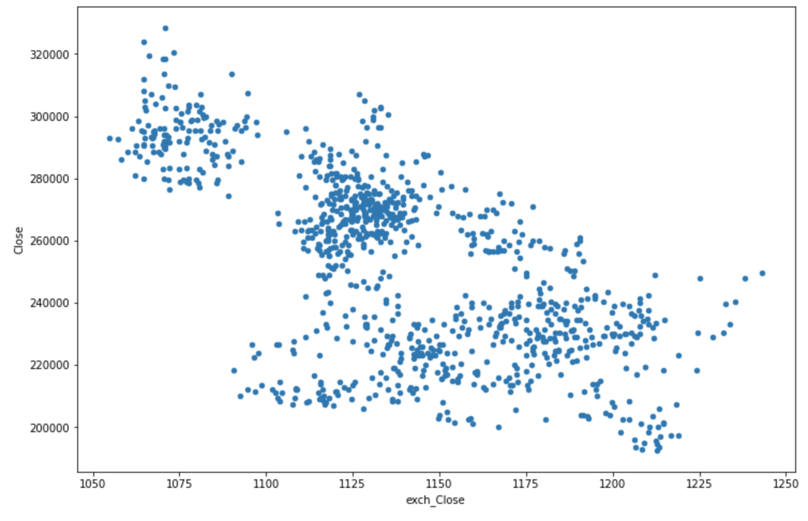
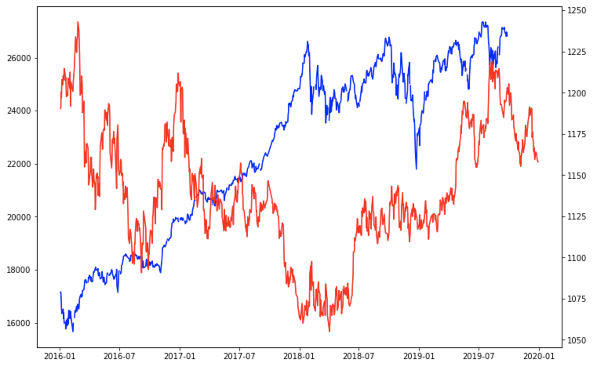
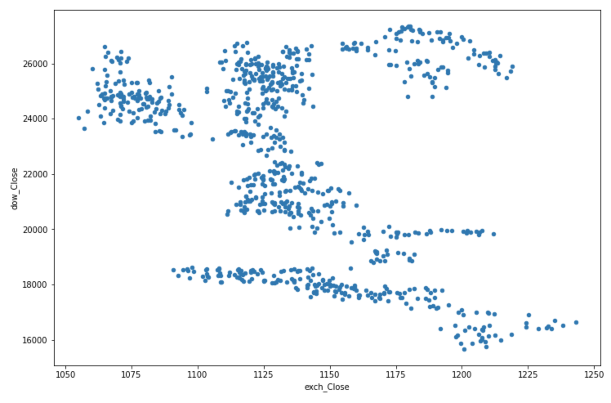

# Mid

## Regression: 주가 예측

- 문제: 당일 주식시장 마감 직후 다음 날짜의 종가를 예측한다.
- 데이터
  - SK 주식회사의 5년치 주가
  - 다우지수
  - 원달러 환율

### 환경준비 

#### Import

```py
import numpy as np
import pandas as pd
import matplotlib.pyplot as plt
```

#### Data Loading

- Open: 장 시작 주가
- High: 장 중 최고가
- Low: 장 중 최저가
- Close: 장 마감 주가(종가)
- ~~AdjClose: 수정된 종가~~
- Volume: 거래량

```py
stock = pd.read_csv('https://raw.githubusercontent.com/DA4BAM/dataset/master/SK.csv')
dow = pd.read_csv('https://raw.githubusercontent.com/DA4BAM/dataset/master/DowJonesIndex.csv')
exch = pd.read_csv('https://raw.githubusercontent.com/DA4BAM/dataset/master/USD_KRW.csv')
```

```py
stock.Date = pd.to_datetime(stock.Date)
dow.Date = pd.to_datetime(dow.Date)
exch.date = pd.to_datetime(exch.date)
```

```py
stock.head() # Date, Open, High, Low, Close, AdjClose, Volume
dow.head() # Date, Close
exch.head() # date, close, open, high, low, diff
```

```py
stock.shape # (977, 7)
dow.shape # (1258, 2)
exch.shape # (1043, 6)
```

```py
stock.isnull().sum()

Date        0
Open        5
High        5
Low         5
Close       5
AdjClose    5
Volume      5
dtype: int64
```

```py
dow.isnull().sum()

Date         0
dow_Close    0
dtype: int64
```

```py
exch.isnull().sum()

Date          0
exch_Close    0
exch_Open     0
exch_High     0
exch_Low      0
exch_Diff     0
dtype: int64
```

##### 컬럼 이름 수정

- dow : Close → dow_Close
- exch : Date → Date, 나머지(exch_Close, exch_..)

```py
dow.columns = ['Date', 'dow_Close']
exch.columns = ['Date', 'exch_Close', 'exch_Open', 'exch_High', 'exch_Low', 'exch_Diff']
```

```py
dow.head()
exch.hed()
```

##### Lef Join

```py
stock2 = pd.merge(stock, dow, how='left')
stock2 = pd.merge(stock2, exch, how='left')
```

### 데이터 이해

```py
stock2.shape # (977, 13)
stock2.isnull().sum()

Date           0
Open           5
High           5
Low            5
Close          5
AdjClose       5
Volume         5
dow_Close     93
exch_Close     0
exch_Open      0
exch_High      0
exch_Low       0
exch_Diff      0
dtype: int64
```

```py
stock2.describe()
```



#### 그래프

##### 주가와 다우지수

```py
# 그래프
plt.rcParams['figure.figsize'] = (12, 8)
fig, ax1 = plt.subplots()

# 왼쪽 Y축
ax1.plot(stock2.Date, stock2.Close, color='blue')

# 오른쪽 보조Y축
ax2 = ax1.twinx() # 축 추가
ax2.plot(stock2.Date, stock2.dow_Close, color='red')

# 표현
plt.show()
```



산점도:

```py
stock2.plot(kind = 'scatter', x='dow_Close', y='Close')
plt.show()
```



##### 주가와 환율

```py
plt.rcParams['figure.figsize'] = (12, 8)
fig, ax1 = plt.subplots()
ax1.plot(stock2.Date, stock2.Close, color='blue')
ax2 = ax1.twinx()
ax2.plot(stock2.Date, stock2.exch_Close, color='red')
plt.show()
```



```py
stock2.plot(kind = 'scatter', x='exch_Close', y='Close')
plt.show()
```



##### 환율과 다우지수

```py
plt.rcParams['figure.figsize'] = (12, 8)
fig, ax1 = plt.subplots()
ax1.plot(stock2.Date, stock2.dow_Close, color='blue')
ax2 = ax1.twinx()
ax2.plot(stock2.Date, stock2.exch_Close, color='red')
plt.show()
```



```py
stock2.plot(kind = 'scatter', x='exch_Close', y='dow_Close')
plt.show()
```



##### 최고가와 최저가

```py
plt.rcParams['figure.figsize'] = (12, 8)
fig, ax1 = plt.subplots()
ax1.plot(stock2.Date, stock2.High, color='blue')
ax2 = ax1.twinx()
ax2.plot(stock2.Date, stock2.Low, color='red')
plt.show()
```

### 데이터 준비 1: Feature Engineering

```py
# import copy
# stock3 = copy.deepcopy(stock2)
```

전일 종가 변수:

```py
stock2['Close_lag1'] = stock2['Close'].shift()
```

전전일 종가대비 전일 종가 등락폭 변수:

```py
stock2['Close_lag1_diff'] = stock2['Close_lag1'].shift() - stock2['Close_lag1']
```

전일 고가대비 저가 등락폭 변수:

```py
stock2['High_Low_lag1_diff'] = stock2['High'].shift() - stock2['Low'].shift()
```

7일 이동평균 종가:

```py
stock2['Close_Moving_Average_7'] = stock2['Close'].rolling(7, min_periods=1).mean().shift()
```

요일 변수:

```py
stock2['Weekday'] = stock2.Date.dt.weekday # 0 ~ 4 월 ~ 금
```

전전일 거래량 대비 전일 거래량 등락폭 변수:

```py
stock2['Volume_lag1_diff'] = stock2['Volume'].shift(2) - stock2['Volume'].shift()
```

7일 이동평균 거래량:

```py
stock2['Volume_Moving_Average_7'] = stock2['Volume'].rolling(7, min_periods=1).mean().shift()
```

7일 이동평균 최고가:

```py
stock2['High_Moving_Average_7'] = stock2['High'].rolling(7, min_periods=1).mean().shift()
```

7일 이동평균 최저가:

```py
stock2['Low_Moving_Average_7'] = stock2['Low'].rolling(7, min_periods=1).mean().shift()
```

전전일 환율대비 전일 환율 등락폭 변수:

```py
stock2['exch_Close_lag1_diff'] = stock2['exch_Close'].shift(2) - stock2['exch_Close'].shift()
```

```py
stock3['exch_Lag1'] = stock3['exch_Close'].shift()
stock3['dow_Lag1'] = stock3['dow_Close'].shift()
stock3['Volume_diff'] = stock3['Volume'].shift() - stock3['Volume'].shift(2)
```

### 데이터 준비 2: 모델링을 위한 전처리

#### NA 처리

```py
stock2.isnull().sum()
```

- fill forward로 채운다.
- 첫번째, 두번째 행은 제거한다.

```py
stock2.fillna(method = 'ffill', inplace=True)
stock2 = stock2.drop([0, 1], axis=0) # stock2 = stock2.iloc[2:, :]
```

#### Dummy Variable

```py
dummies = pd.get_dummies(stock4['WeekDay'], prefix='wd', drop_first=True)
stock4 = pd.concat([stock4, dummies], axis=1)

drop_vars = ['Open','High','Low','AdjClose','Volume','dow_Close','exch_Close','exch_Open','exch_High','exch_Low','exch_Diff']
stock4 = stock4.drop(drop_vars, axis=1)
```

#### Data Split

- set1 - train1 : `2016.01 ~ 2019.03`, val1 : `2019.04 ~ 05`
- set2 - train2 : `2016.01 ~ 2019.05`, val2 : `2019.06 ~ 07`
- set3 - train3 : `2016.01 ~ 2019.07`, val3 : `2019.08 ~ 09`

```py
# set1 
train1 = stock4.loc[ stock4.Date < '2019-04-01']
val1 = stock4.loc[ (stock4.Date >= '2019-04-01') & (stock4.Date < '2019-06-01')]

train1_x = train1.drop(['Date', 'Close'], axis =1 )
val1_x = val1.drop(['Date', 'Close'], axis = 1)

train1_y = train1.loc[:,'Close']
val1_y = val1.loc[:,'Close']


# set2
train2 = stock4.loc[ stock4.Date < '2019-06-01']
val2 = stock4.loc[ (stock4.Date >= '2019-06-01') & (stock4.Date < '2019-08-01')]

train2_x = train2.drop(['Date', 'Close'], axis =1 )
val2_x = val2.drop(['Date', 'Close'], axis = 1)

train2_y = train2.loc[:,'Close']
val2_y = val2.loc[:,'Close']

# set3
train3 = stock4.loc[ stock4.Date < '2019-08-01']
val3 = stock4.loc[ (stock4.Date >= '2019-08-01') & (stock4.Date < '2019-10-01')]

train3_x = train3.drop(['Date', 'Close'], axis =1 )
val3_x = val3.drop(['Date', 'Close'], axis = 1)

train3_y = train3.loc[:,'Close']
val3_y = val3.loc[:,'Close']
```

#### Scaling

```py
# 필요한 함수 로딩
from sklearn.preprocessing import MinMaxScaler

# 함수 선언
scaler1 = MinMaxScaler()
scaler2 = MinMaxScaler()
scaler3 = MinMaxScaler()

# 함수 만들기
scaler1.fit(train1_x)
scaler2.fit(train2_x)
scaler3.fit(train3_x)

# 함수 적용하기
train1_x = scaler1.transform(train1_x)
val1_x = scaler1.transform(val1_x)
train2_x = scaler2.transform(train2_x)
val2_x = scaler2.transform(val2_x)
train3_x = scaler3.transform(train3_x)
val3_x = scaler3.transform(val3_x)
```

#### 모델링1: 기본 알고리즘

- 모델링
   - 하나의 알고리즘으로 세번 모델링, 예측, 평가를 수행한 후
   - 평가결과(rmse, mape)의 평균을 계산합니다.

- 사용할 알고리즘
   - Linear Regression
   - knn
   - decision tree

- 튜닝
   - knn, decision tree에 대해서 하이퍼파라미터를 수동으로 조정하며 튜닝을 합니다.

```py
from sklearn.linear_model import LinearRegression
from sklearn.neighbors import KNeighborsRegressor
from sklearn.tree import DecisionTreeRegressor
from sklearn.metrics import mean_squared_error, mean_absolute_error
```

```py
rmse = []
mae = []

model = LinearRegression()

model.fit(train1_x, train1_y)
val1_pred = model.predict(val1_x)
rmse.append(mean_squared_error(val1_y, val1_pred, squared=False))
mae.append(mean_absolute_error(val1_y, val1_pred))

model.fit(train2_x, train2_y)
val2_pred = model.predict(val2_x)
rmse.append(mean_squared_error(val2_y, val2_pred, squared=False))
mae.append(mean_absolute_error(val2_y, val2_pred))

model.fit(train3_x, train3_y)
val3_pred = model.predict(val3_x)
rmse.append(mean_squared_error(val3_y, val3_pred, squared=False))
mae.append(mean_absolute_error(val3_y, val3_pred))

print(rmse)
print(mae)
```

```py
rmse = []
mae = []

model = KNeighborsRegressor()

model.fit(train1_x, train1_y)
val1_pred = model.predict(val1_x)
rmse.append(mean_squared_error(val1_y, val1_pred, squared=False))
mae.append(mean_absolute_error(val1_y, val1_pred))

model.fit(train2_x, train2_y)
val2_pred = model.predict(val2_x)
rmse.append(mean_squared_error(val2_y, val2_pred, squared=False))
mae.append(mean_absolute_error(val2_y, val2_pred))

model.fit(train3_x, train3_y)
val3_pred = model.predict(val3_x)
rmse.append(mean_squared_error(val3_y, val3_pred, squared=False))
mae.append(mean_absolute_error(val3_y, val3_pred))

print(rmse)
print(mae)
```

```py
rmse = []
mae = []

model = DecisionTreeRegressor()

model.fit(train1_x, train1_y)
val1_pred = model.predict(val1_x)
rmse.append(mean_squared_error(val1_y, val1_pred, squared=False))
mae.append(mean_absolute_error(val1_y, val1_pred))

model.fit(train2_x, train2_y)
val2_pred = model.predict(val2_x)
rmse.append(mean_squared_error(val2_y, val2_pred, squared=False))
mae.append(mean_absolute_error(val2_y, val2_pred))

model.fit(train3_x, train3_y)
val3_pred = model.predict(val3_x)
rmse.append(mean_squared_error(val3_y, val3_pred, squared=False))
mae.append(mean_absolute_error(val3_y, val3_pred))

print(rmse)
print(mae)
```

- Linear Regression: 1
  - [3479.7390867902013, 3041.3884149421, 3788.3301099046084]
  - [2622.125946822952, 2302.3720207013844, 2791.564566902192]
- KNN Regression: 3
  - [14796.283317103656, 17912.02043853446, 25654.059133010513]
  - [11411.627906976744, 16814.285714285714, 24777.5]
- DecisionTree Regression: 2
  - [4994.182662369917, 5624.140145920297, 6363.961030678927]
  - [4255.813953488372, 4619.047619047619, 5150.0]

### 모델링2

- 모델링
  - 하나의 알고리즘으로 세번 모델링, 예측, 평가를 수행한 후
  - 평가결과(rmse)의 평균을 계산합니다.
  - 할수 있는 방법을 동원해서 성능을 높여봅시다.
- 사용할 알고리즘
  - rf
  - xgb
  - ann
  - 그 외...sklearn에서 사용 가능한 알고리즘
- 튜닝
  - 시간(날짜) 기준으로 분할한 것이기에 randmo search나 grid search는 사용하지 마시고, for loop로 하이퍼파라미터를 튜닝하시오.

```py
from sklearn.ensemble import RandomForestRegressor
result_rf = []
for n in range(10, 300, 10):
  model = RandomForestRegressor(n_estimators=n)
  model.fit(train1_x, train1_y)
  val2_pred = model.predict(val1_x)
  model.fit(train2_x, train2_y)
  val2_pred = model.predict(val2_x)
  model.fit(train3_x, train3_y)
  val3_pred = model.predict(val3_x)

  val1_rmse = mean_squared_error(val1_y, val1_pred, squared=False)
  val2_rmse = mean_squared_error(val2_y, val2_pred, squared=False)
  val3_rmse = mean_squared_error(val3_y, val3_pred, squared=False)

  result_rf.append((val1_rmse + val2_rmse + val3_rmse)/3)

plt.plot(result_rf)
plt.show()
```

```py
from xgboost import XGBRegressor
result_xgb = []
for n in range(10, 300, 10):
  model = XGBRegressor(n_estimators=n)
  model.fit(train1_x, train1_y)
  val2_pred = model.predict(val1_x)
  model.fit(train2_x, train2_y)
  val2_pred = model.predict(val2_x)
  model.fit(train3_x, train3_y)
  val3_pred = model.predict(val3_x)

  val1_rmse = mean_squared_error(val1_y, val1_pred, squared=False)
  val2_rmse = mean_squared_error(val2_y, val2_pred, squared=False)
  val3_rmse = mean_squared_error(val3_y, val3_pred, squared=False)

  result_xgb.append((val1_rmse + val2_rmse + val3_rmse)/3)

plt.plot(result_xgb)
plt.show()
```


```py
from sklearn.neural_network import MLPRegressor
result_ann = []
for n in range(10, 300, 10):
  model = MLPRegressor(hidden_layer_sizes=(n,), early_stopping=True ,verbose=True)
  model.fit(train1_x, train1_y)
  val2_pred = model.predict(val1_x)
  model.fit(train2_x, train2_y)
  val2_pred = model.predict(val2_x)
  model.fit(train3_x, train3_y)
  val3_pred = model.predict(val3_x)

  val1_rmse = mean_squared_error(val1_y, val1_pred, squared=False)
  val2_rmse = mean_squared_error(val2_y, val2_pred, squared=False)
  val3_rmse = mean_squared_error(val3_y, val3_pred, squared=False)

  result_ann.append((val1_rmse + val2_rmse + val3_rmse)/3)

plt.plot(result_ann)
plt.show()
```

```py
min(result_rf) # 4832.582971888066
min(result_xgb)
min(result_ann)
```
